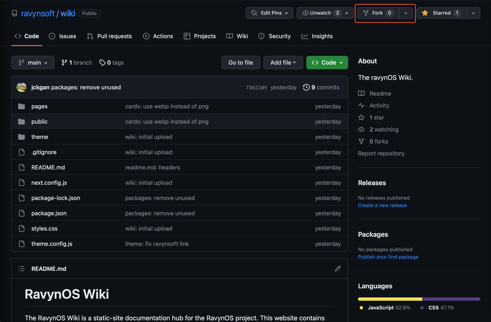
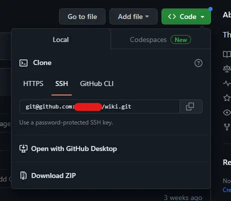

import { Steps } from 'nextra-theme-docs'

# Forking the Wiki

The first step of incorporating your changes into the ravynOS Wiki entails forking the website from GitHub. Doing this will provide you with a localised copy of the website, allowing you to implement your desired changes to the website. In the next few steps, you will know how to submit your changes to the main repository.

Forking the Wiki (and subsequently the remainder of the guide) requires you:

 - Have a GitHub account
 - Have a working IDE/TextEditor
 - Have access to a terminal

<Steps>

### To begin, we'll navigate to the [ravynOS Wiki Repository](https://github.com/ravynsoft/wiki)

### Once on the repository page, press the `Fork` button. 

The fork button is located on the top row near the `Watch` and `Starred` buttons.



### Upon pressing fork, you'll be prompted to add a repository name/description, you can ignore and leave these as default and press the `"Create Fork"` button.

### Finally, clone your fork from GitHub. 

To do this, copy the URL of your forked repository in your browser, then open your terminal and type 

```sh
git clone [FORK_URL]
```

</Steps>
