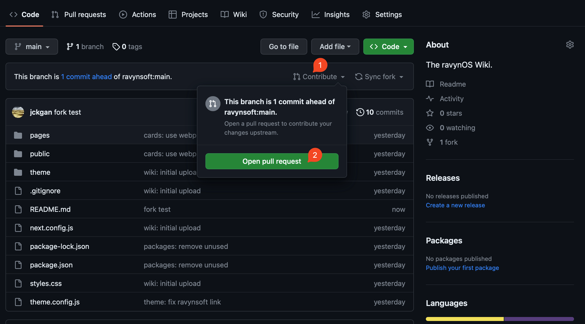
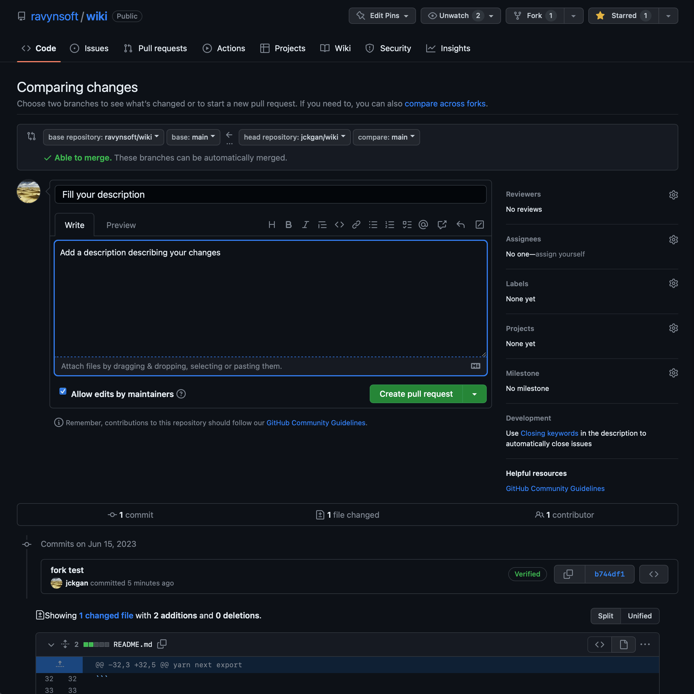

# Submitting your changes

Once you have successfully incorporated your modifications into your local copy and ensured the absence of any issues, we can proceed with implementing these changes into the main repository by submitting a pull request.

In order to do this, you must add your changes to push to your fork, here's a quick guide:

```sh
git add .
git commit -m "[DESCRIPTIVE COMMIT MESSAGE HERE]"
git push -u origin main
```

Now, if you visit your forked repository on GitHub (https://github.com/[your_user_name]/wiki), you should see your modifications.

To open a pull-request in the main repository, press the `"Contribute"` button, then press `"Open Pull Request"`. (See below for visual guide)



Upon pressing the button, you will be taken to a summary of your changes. Give your pull-request an appropriate and descriptive title, alongside a description of your changes. Once done, you can press the `"Create pull request"` button to start the pull-request. (See below for visuals)



Once submitted, wait for somebody to review your changes, and eventually merge your changes. You will recieve notifications in the web-app (or mobile app if you have it installed) on any pull-request update.