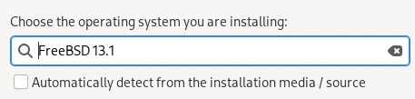
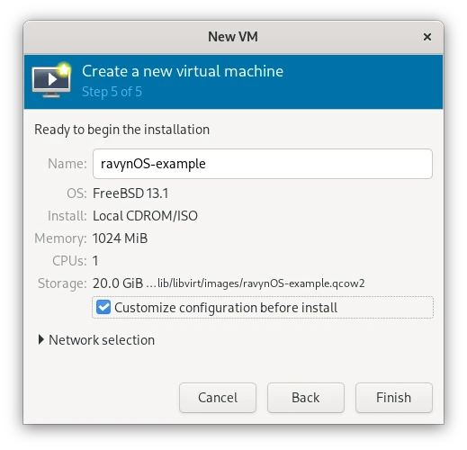
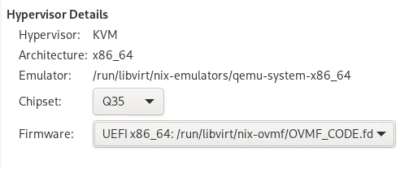
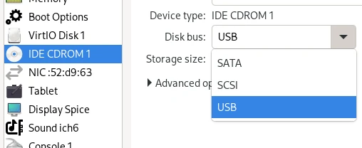

import { Callout } from 'nextra/components'
import { Steps } from 'nextra-theme-docs'

# Virtualization Setup
ravynOS currently does not support graphics under virtual machines, progress is however underway.
Virtualization is currently efficient for developers to develop and design non-graphical applications without the need to install ravynOS on hardware.

Below are steps on how to setup a virtualized environment for ravynOS to run in.

## Preparing

Make sure you have downloaded our ISO, ready to setup your virtualized environment. You can find our mirror list [here](/download/mirror-list) to download an ISO.

## Setting Up

<Callout type="warning" emoji="⚠️">
  These steps are for Qemu/KVM for use with virsh/virt-manager (tested with v0.4.0)
</Callout>
<Steps>
### Create a new virtual machine
### Select FreeBSD13.1 as the Operating System
<></>
### Choose the ravynOS ISO as the install media
### Create 20GB in Hard Drive Storage
<Callout type="error" emoji="🚫">
  Before finishing setup, click on "Customize configuration before install" 
<></>
</Callout>
### Select UEFI instead of BIOS and select q35
<></>
### Set the Boot Option CD-ROM to SATA-type
<></>
### Finish setup
<Callout>
Follow the instructions in [Installing ravynOS](../installing-ravynos/installing-pygmy-marmoset)
</Callout>
</Steps>

<Callout type="info" emoji="ℹ️">
In the TianoCore UEFI (enter this with the ESC key), it may be helpful to change the preferred screen resolution via Device Manager > OVMF Platform Configuration to something greater than 1024x768
</Callout>
